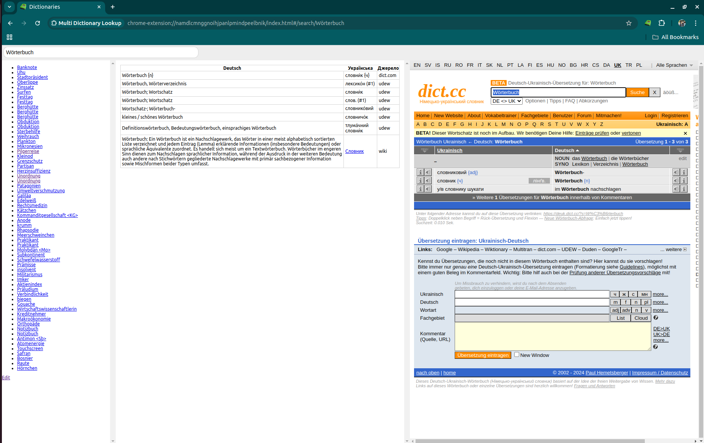

Extension for meta-search across multiple German-Ukrainian dictionaries.

Розширення для мета-пошуку по кількох німецько-українських словниках. Щоб не шукати по 3-4 рази окремо.

## Інсталяція:

1. Склонувати чи скачати репозиторій.
2. Відкрити chrome://extensions/
3. Натиснути "Load unpacked".
4. Вибрати директорію з репозиторієм.

